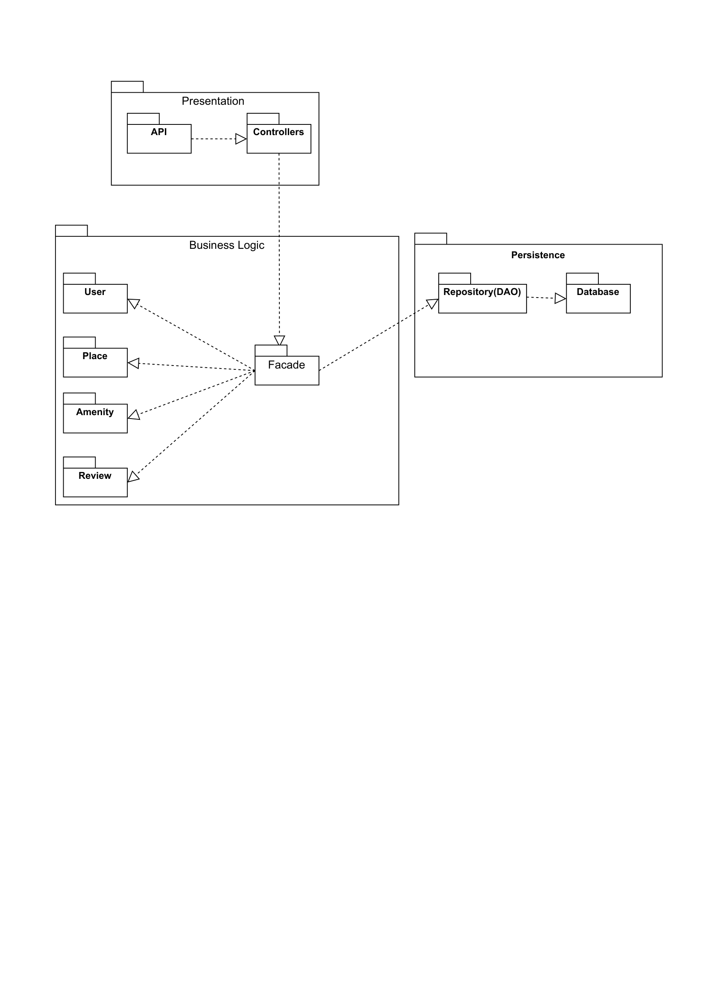
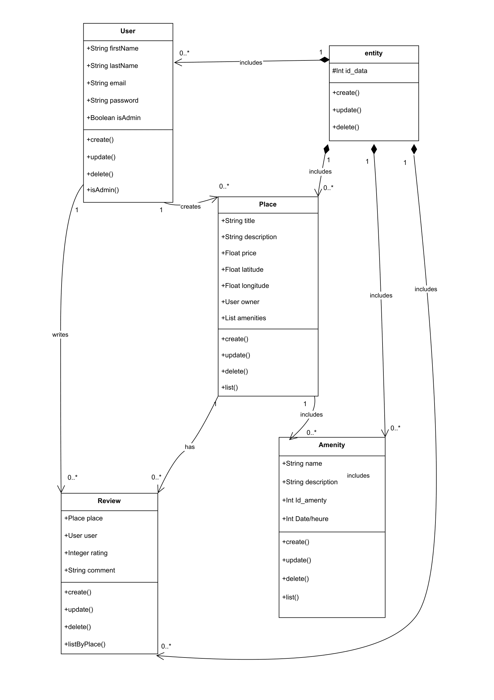

# HBnB Technical Architecture Document
## 1. Introduction
1.1 Purpose of the Document
This document provides a comprehensive technical overview of the HBnB
project architecture and design. It compiles the different diagrams
produced during the design phase, including the high-level package
diagram, the detailed class diagram for the Business Logic layer, and
the sequence diagrams for API calls.

The purpose of this document is to serve as a technical blueprint for
the implementation phases of the project. It explains the architectural
choices, the responsibilities of each component, and the interactions
between layers, ensuring that the system remains maintainable, scalable,
and well-structured.

1.2 Project Overview
HBnB is a layered application designed to manage users, places,
amenities, and reviews. The system follows a clean architectural
approach with a clear separation of concerns between the Presentation,
Business Logic, and Persistence layers. This structure allows the
application to evolve over time while keeping the core business logic
independent from both the API layer and the data storage mechanism.

## 2. High-Level Architecture

Figure 1: High-Level Package Diagram of the HBnB architecture

2.1 Purpose of the Diagram
The high-level package diagram presents the global architecture of the
HBnB application. It illustrates how the system is divided into three
main layers: Presentation, Business Logic, and Persistence. The diagram
also shows the dependencies between these layers and the general flow of
a request from the API to the database.

2.2 Key Components
Presentation Layer - API: Entry point for client requests. -
Controllers: Handle incoming requests and delegate processing to the
Business Logic layer.

Business Logic Layer - Facade: Provides a unified interface to the
business logic. - Domain entities: User, Place, Amenity, Review.

Persistence Layer - Repository: Abstracts data access. - Database:
Stores the application data.

2.3 Design Decisions and Rationale
The application follows a layered architecture to ensure a clear
separation of concerns. The Facade pattern centralizes access to
business operations and reduces coupling. The Repository pattern
abstracts data access and keeps the business logic independent from
storage technology. Dependencies are unidirectional to avoid circular
dependencies and enforce a clean architecture.

2.4 Role in the Overall Architecture
This diagram defines the core structure of the HBnB application and
serves as a reference for organizing the codebase.

## 3. Business Logic Layer

Figure 2: Detailed Class Diagram of the Business Logic Layer

3.1 Purpose of the Diagram
The detailed class diagram describes the internal structure of the core
domain and the relationships between entities.

3.2 Key Classes and Entities
The main entities are: - User - Place - Amenity - Review

The Facade class acts as the main entry point for the Presentation
layer.

3.3 Design Decisions and Rationale
The domain is modeled using explicit entity classes to reflect
real-world concepts. The Facade pattern hides internal complexity and
improves maintainability and testability.

3.4 Role in the Overall Architecture
The Business Logic layer represents the core of the application and
contains all business rules.

## 4. API Interaction Flow
❤️ **Insert Sequence Diagrams here**
Figure 3+: Sequence Diagrams for API Calls

4.1 Purpose of the Diagrams
The sequence diagrams illustrate how API calls are processed and how
components interact at runtime.

4.2 Key Components Involved
API\
Controllers\
Facade\
Domain entities\
Repository\
Database
4.3 Design Decisions and Rationale
All interactions follow the layered architecture and unidirectional
dependencies, ensuring consistency and clarity.

4.4 Role in the Overall Architecture
These diagrams complement the static diagrams by showing the runtime
behavior of the system.

## 5. Conclusion
This document defines the architecture and design of the HBnB
application and serves as a blueprint for implementation. The
combination of high-level architecture, detailed business logic design,
and API interaction flows ensures a clean, scalable, and maintainable
system.
